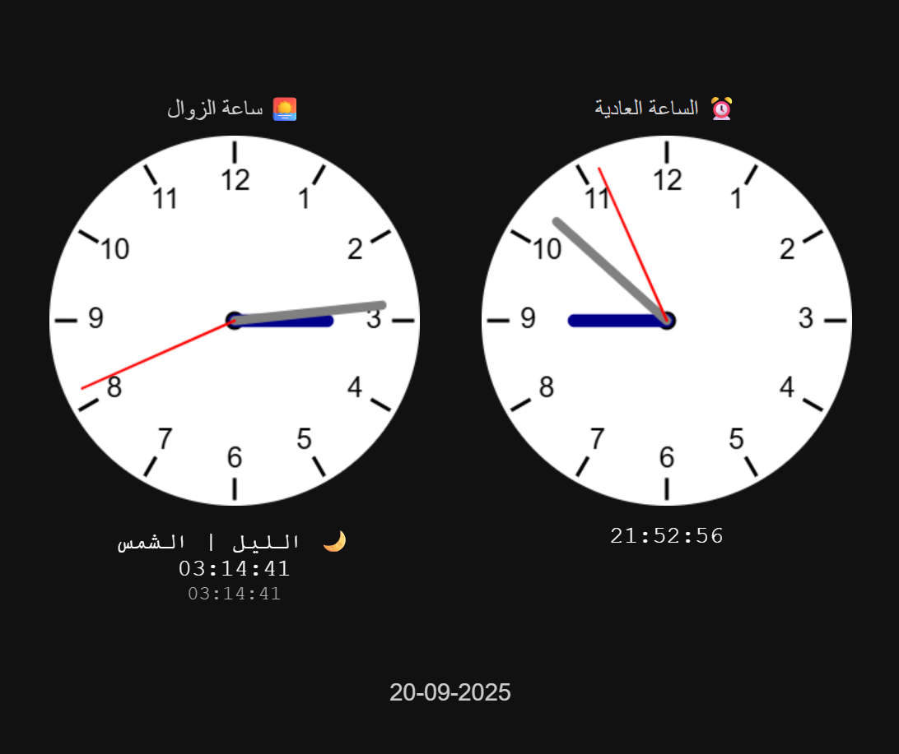

# ساعة الزوال / Solar Time Clock

> ساعة زوالية دقيقة تعمل بنظام 24 ساعة، تقسم النهار إلى 12 ساعة زوالية والليل إلى 12 ساعة زوالية — مع عرض رقمي وتماثلي (Analog) دقيق يعتمد على أوقات الشروق والغروب المحلية.  
> A precise solar clock operating on a 24-hour system, dividing day and night each into 12 unequal solar hours — with accurate digital and analog display based on local sunrise/sunset times.

تم تطوير هذا المشروع بواسطة [h-phsoft](https://github.com/h-phsoft).

---

  
    
  <strong>ساعة الزوال / Solar Time Clock</strong>

---

## 🌐 العرض التجريبي المباشر / Live Demo

جرب الساعة مباشرة على:  
👉 **[https://h-phsoft.github.io/zawal-clock/](https://h-phsoft.github.io/zawal-clock/)**

---

## 🧩 الميزات / Features

### بالعربية:
- ⏳ **ساعة زوالية دقيقة**: تقسيم اليوم إلى 24 ساعة زوالية (12 نهار + 12 ليل) — كل ساعة طولها متغير حسب طول النهار أو الليل.
- 🌞 **ساعة نهارية**: تبدأ من شروق الشمس وتنتهي عند غروبها — 12 ساعة زوالية.
- 🌙 **ساعة ليلية**: تبدأ من غروب الشمس وتنتهي عند شروق اليوم التالي — 12 ساعة زوالية.
- 🎨 **عرض مزدوج**:
  - **تماثلي (Analog)**: ساعة دائرية بأرقام 1–12 وعقارب دقيقة.
  - **رقمي (Digital)**: يعرض الوقت الزوالي بدقة الثواني + اسم الكوكب الحاكم + الفترة (نهار/ليل).
- 🪐 **أسماء الكواكب**: كل ساعة زوالية مرتبطة بكوكب (زحل، المشتري، المريخ...) حسب النظام الفلكي التقليدي.
- 📅 **عرض التاريخ**: في أسفل الصفحة بصيغة `dd-mm-yyyy`.
- 🔄 **تحديث لحظي**: كل ثانية يتم إعادة حساب الوقت الزوالي وإعادة رسم العقارب.
- 📱 **متجاوب**: يعمل على جميع الأجهزة (جوال، تابلت، حاسوب).
- 📁 **لا يحتاج خادم**: يعمل مباشرة من ملف HTML واحد.

### In English:
- ⏳ **Precise Solar Time**: Divides the day into 24 solar hours (12 for day, 12 for night) — each hour’s length varies with daylight/night duration.
- 🌞 **Day Hours**: From sunrise to sunset — 12 solar hours.
- 🌙 **Night Hours**: From sunset to next sunrise — 12 solar hours.
- 🎨 **Dual Display**:
  - **Analog**: Circular clock with 1–12 markings and smooth-moving hands.
  - **Digital**: Shows solar time down to the second + ruling planet + period (day/night).
- 🪐 **Planetary Hours**: Each solar hour is associated with a planet (Saturn, Jupiter, Mars...) based on traditional astrology.
- 📅 **Date Display**: At the bottom in `dd-mm-yyyy` format.
- 🔄 **Real-time Update**: Recalculates and redraws every second.
- 📱 **Fully Responsive**: Works on mobile, tablet, and desktop.
- 📁 **Zero Server Needed**: Runs directly from a single HTML file.

---

## 🚀 كيفية الاستخدام / How to Use

1. **افتح الملف `index.html` مباشرة في متصفحك**.  
   *(لا حاجة لخادم — يعمل فورًا بدون تثبيت)*

2. **شاهد ساعتين في آن واحد**:
   - ⏰ **الساعة العادية**: تعرض الوقت المحلي (24 ساعة عادية).
   - 🌅 **ساعة الزوال**: تعرض الوقت الزوالي بدقة الثواني.

3. **التحديث التلقائي**: الساعة تحدث نفسها كل ثانية — لا حاجة للتحديث اليدوي.

---

## 📜 الترخيص / License

هذا المشروع مرخص تحت رخصة **MIT** — مفتوح المصدر للاستخدام الشخصي والتجاري.  
✅ يمكنك: الاستخدام، التعديل، التوزيع — حتى تجاريًا — مع الإبقاء على حقوق الملكية.

This project is licensed under the **MIT License** — free to use, modify, and distribute — even commercially — as long as you preserve the copyright notice.

📄 [عرض نص الرخصة الكاملة](LICENSE)

---

## 🤝 المساهمة / Contributing

نرحب بالمساهمات! ❤️  
سواء كنت مطورًا، مصممًا، أو محررًا — مشاركتك تهمنا.

### كيف تساهم؟

1. 🐛 **أبلغ عن خطأ**: افتح [Issue جديد](https://github.com/h-phsoft/zawal-clock/issues/new?template=bug_report.md)
2. 💡 **اقتراح ميزة**: افتح [Issue جديد](https://github.com/h-phsoft/zawal-clock/issues/new?template=feature_request.md)

---

## 📬 التواصل / Contact

لأي استفسار أو اقتراح — نحن هنا لمساعدتك:

📧 **البريد الإلكتروني**: [h.phsoft@gmail.com](mailto:h.phsoft@gmail.com)  
🐙 **GitHub**: [@h-phsoft](https://github.com/h-phsoft)  
🌍 **المشروع الحي**: [h-phsoft.github.io/zawal-clock](https://h-phsoft.github.io/zawal-clock/)

---

## 📜 سياسة الاستخدام / Usage Policy

هذا المشروع مخصص **للأغراض التعليمية، البحثية، والبرمجية فقط**.  
❌ **ممنوع تمامًا** استخدامه لأي غرض:

- مخالف للقوانين المحلية أو الدولية.
- يُشجع على الكراهية، التمييز، أو ازدراء الأديان.
- تجاري دون إذن مسبق من المؤلف.
- ضار أو مسيء بأي شكل.

استخدامك لهذا المشروع يعني موافقتك على هذه الشروط.

---

This project is intended **for educational, research, and programming purposes only**.  
❌ **Strictly prohibited** to use it for any purpose that:

- Violates local or international laws.
- Promotes hate, discrimination, or religious disrespect.
- Commercial use without prior written permission.
- Harmful or abusive in any form.

Your use of this project implies acceptance of these terms.

---
